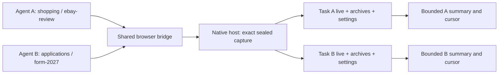

# Workspace isolation and bounded agent context

Implemented and verified 2026-09-20.

## Why an agent on another site saw eBay

Rep previously treated one global `live.json` as the current capture. The next
capture could replace it. All primary/ignore/mute settings, notes, and archives
also lived in one global store. `summary` read global live traffic; `context`
combined every saved session and note. Consequently the two commands could
present different, unrelated histories as the agent's current evidence.

Explicit browser operations were already serialized by the extension. That
protected an operation while it ran, but did not establish who owned its result.
The CLI reread global live data after its RPC completed, and saving could reread
it again after the next operation had started. Separate browser/native-host
processes also shared the same global live-file destination.

The statement “Rep only had eBay traffic, so I could not inspect the other form”
confused capture inventory with browser capability. A missing capture means the
agent needs an authorized observation of the requested site. It does not mean
the user has to open the form manually or that the browser cannot reach it.

## Data ownership



The diagram shows logical ownership; each result is routed to its requesting
CLI's selected task, not broadcast to both stores. Bridge discovery is shared;
dataset paths are not. Storage is under
`~/.local/share/rep-cli/workspaces/WORKSPACE/tasks/TASK/` (XDG override supported).

Selection is process-local: explicit flags, environment, then a project binding
for the workspace. Task selection must be explicit for CLI data commands. A
missing scope or task fails before loading data or starting a capture. There is
no global active-workspace file for agents to race over. Existing global data
stays untouched and requires an explicit `--global` to read it.

```sh
# Agent A, on every call:
rep --workspace shopping --task ebay-review scope -j
rep --workspace shopping --task ebay-review summary --max-bytes 4096

# Agent B, on every call:
rep --workspace applications --task form-2027 scope -j
rep --workspace applications --task form-2027 summary --max-bytes 4096
```

For a project directory, `rep workspace init applications` records only its
workspace in `.rep/workspace.json`. Each agent still supplies `--task` or starts
with `REP_TASK` in its own process environment. Distinct agents must use distinct
tasks, including when they share a repository. Task names can be reused when
intentionally resuming the same work. No site names are inferred from old traffic.

## Exact capture handoff

Before scoped browse/fetch/action, the CLI negotiates immutable snapshot support.
An older host is rejected before the browser operation. On completion, the host
seals a private snapshot under its own instance and capture session identity.
The CLI retrieves that exact reference and validates schema, host, session,
completion, request count, file size, and SHA-256 before publishing anything.
It never substitutes the global live file when an exact snapshot is missing.

The same verified in-memory export is archived and written atomically as this
task's latest capture. A later task or capture cannot make an earlier request ID
refer to another task's data. Results carry workspace/task, capture verification,
and saved IDs; full archive hashes disambiguate timestamp-based display names.
Conflicting host reset/ambient messages and late foreign-session updates are
rejected while an explicit capture is active.

Scoped results include at most 16 request descriptors. Total/omitted/complete
fields disclose the projection, while all captured requests remain archived.
Source/terminal outcome IDs survive limits on longer path/failure lists.

Request lookup prefers full IDs over prefixes and rejects ambiguous prefixes or
semantic aliases. `body --saved SAVED_HASH_ID` pins retrieval to one archive,
including when a later capture reuses the same request ID. Without `--saved`,
an exact live ID refers to the current capture; otherwise lookup considers this
task's archives without letting a live prefix override an exact archived ID.

Temporary host snapshots retain 32 entries for one hour. The body-capture update
raises defaults to 1 GiB aggregate and 512 MiB for one snapshot, with configurable
host budgets negotiated by the CLI. Expired/oversized snapshots fail explicitly.
Durable task archives are retained; they are not silently garbage-collected.
See [body transport, parsing, and limits](body-capture.md).

## Context projection and incremental delivery

Ownership is deterministic. Jev is not used to guess which agent owns a capture.
Summary generation also needs no model call. Jev remains useful for semantic
selection among explicitly observed page elements within an authorized task.

The context projection uses six steps:

1. Select exactly one task's live capture or one requested archive. Notes and
   unrelated archives do not enter the projection.
2. Aggregate by HTTP method, canonical origin, and normalized route. Query
   values are removed; numeric/opaque path segments are generalized. Schemes and
   nondefault ports remain distinct.
3. Keep counts, response statuses, resource types, and representative real IDs.
   Hash raw response content locally to detect late changes, without printing it.
4. Spread output across origin/method/status classes so a chatty endpoint cannot
   consume every slot. Stable ordering makes repeated views reproducible.
5. Fit complete groups inside an exact JSON byte budget, including optional
   envelope and newline. Preserve provenance, totals, and omission counts.
6. Return a content-addressed cursor acknowledging only groups/removals actually
   delivered. The next delta can deliver both changes and previously omitted data.

```sh
rep --workspace applications --task form-2027 summary --max-bytes 4096
rep --workspace applications --task form-2027 context --since RETURNED_CURSOR --max-bytes 4096
rep --workspace applications --task form-2027 body REQUEST_ID --head 4096
rep --workspace applications --task form-2027 summary --saved SAVED_HASH_ID
rep --workspace applications --task form-2027 body REQUEST_ID --saved SAVED_HASH_ID --head 4096
```

Use the newest cursor on each call. A partial result does not acknowledge hidden
changes, so a small budget cannot silently erase them. Cursors bind to scope,
source, and filters; changing those requires a fresh baseline. Checkpoints store
hashes, use private files, and expire after 24 hours with a 64-entry limit.
`no_change` describes the selected capture, not proof that the website itself
has remained unchanged without a fresh observation.

This implements progressive retrieval and compact tool responses. These design
principles are also discussed in Anthropic's primary engineering articles on
[context engineering](https://www.anthropic.com/engineering/effective-context-engineering-for-ai-agents)
and [tool design](https://www.anthropic.com/engineering/writing-tools-for-agents).
Rep's isolation, exact snapshot routing, delivered-only cursors, and regression
results here come from this repository's implementation, not those articles.

## Verification and practical limits

Tests cover two tasks with unrelated global eBay data, empty-task behavior,
late/foreign session updates, active reset races, old-host preflight, malformed
and expired snapshots, same-ID artifact isolation, changed archive/filter cursor
rejection, and partial-delta draining. A 2,000-request fixture collapses into one
route group. A 1,000-request capture fixture returns under 8 KiB of descriptor
metadata while retaining all 1,000 bodies in its task data and archive. Those are
synthetic measurements, not a claim of a fixed token saving for every website.

`scripts/verify_agent_context.py` exercises the real CLI and native-host socket
with a synthetic extension peer. It deliberately withholds both capture RPC
results until both captures have been sealed, so a caller must retrieve its
earlier snapshot after shared live data has changed. Concurrent tasks retained
1,000 and 200 requests independently; previews contained 16 descriptors each,
and their summaries used 1,103 and 1,111 bytes against a 2,048-byte budget after
adding body completeness counts. The
check also passed empty-task behavior, unchanged deltas, foreign cursor/body
rejection, independent primary settings, and retrieval from an earlier archive
after a new capture. These byte counts describe this synthetic fixture.

```sh
REP_BINARY="$HOME/.local/bin/rep" REP_HOST_BINARY="$HOME/.local/bin/rep-host" \
  python3 scripts/verify_agent_context.py
```

Full Go tests pass. Canvas tests pass (119); extension tests pass (237). Canvas
RepClient and Arcctl RepProcess now give each instance a unique default task,
keep that task stable for their subprocesses, and accept explicit workspace/task
options or process environment for intentional continuity.

Dataset namespaces prevent accidental context mixing. They do not isolate
browser cookies/accounts/tabs or prevent another process running as the same OS
user from deliberately opening files or selecting another task. Use task-owned
tabs; use separate browser profiles when login state must be independent. The
new `browser headless start` lifecycle provides a private Chromium profile per
task; [headless.md](headless.md) describes login setup and reuse. All-tab
ambient watching and legacy shared credential/mobile workflows are unsupported
inside a scoped task. Concurrent metadata edits within the same task are not
transactional, so independent agents should never share one task identity.

Route redaction is heuristic; names in paths can still be personal information.
Raw capture data remains local and should be fetched only when relevant. Durable
archives use the existing JSONL format and can grow on disk; body blob storage
and a lazy archive index are sensible future storage work, not shipped claims.
Byte budgets are exact; tokenizer-dependent token counts are not.

## Activation check

The updated CLI and native host are installed in `~/.local/bin`. The user
explicitly authorized interrupting the old active/queued captures; the Rep
extension was reloaded and the new host reconnected with zero active/queued
captures and immutable-snapshot protocol support.

An actual Arc check captured a local synthetic page into a temporary task store,
verified and automatically archived its two requests, closed its owned tab, and
returned a 1,277-byte summary plus an 814-byte unchanged delta. A different task
returned `no_capture`. Temporary verification data was removed. This check used
a local fixture, not a user form or account-changing action.
