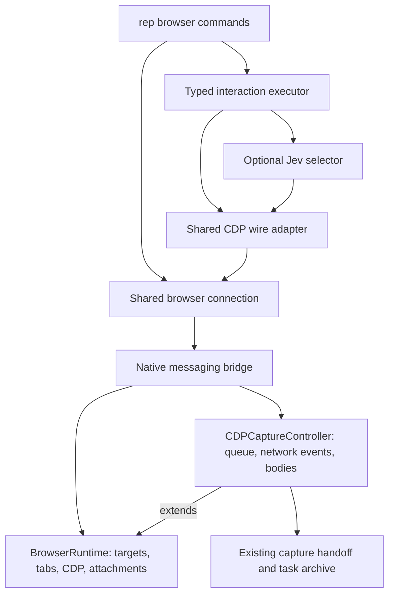

# Browser runtime architecture

Rep exposes browser workflows through one command family. Typed interactions,
semantic selection, raw CDP, and network capture share browser connection and
protocol code. Network capture owns its own state; semantic selection is an
optional dependency of the interaction executor.



## Responsibilities

| Layer | Location | Owns |
|---|---|---|
| CLI | `cmd/browser_*.go` | Arguments, command-local options, deadlines, output |
| Connection | `cmd/browser_connection.go` | Selecting Arc/Chrome or the task's headless bridge |
| Protocol | `internal/browserrpc` | CDP request wrapping and response decoding |
| Interactions | `internal/browserflow` | Plan validation, target checks, input adapters, outcome checks, reports |
| Semantic selection | `internal/jevdom` | Accessible candidates, Jev choices, cache, freshness, confidence and coverage |
| Extension control | `rep/js/background/browser-runtime.js` | Tabs, targets, debugger attachment, evaluation, reload coordination |
| Extension capture | `rep/js/background/cdp-capture.js` | Serialized capture operations, request/body collection and capture status |

The interaction package consumes a small selection result and a callback; it
does not import Jev. The command layer wires Jev in only for a target with a
semantic goal. Exact selectors and names need no model or credentials. The
existing native host and capture archive format remain compatible.

The extension capture controller specializes three capture-state hooks in the
browser runtime. Attachment and reload checks therefore still see active
captures, while standalone browser control can be tested without capture state.
The existing background RPC routes continue to use one controller instance.

## Smaller command surface

Set `REP_WORKSPACE` and `REP_TASK` in the calling process, or pass the existing
`--workspace` and `--task` flags. Browser choice defaults to Arc.

```sh
rep browser select 'Save button' --tab ID --raw-json
rep browser interact flow.json --tab ID --raw-json
rep browser interact flow.json --tab ID --apply --raw-json
rep browser action @capture.js --tab ID --raw-json
```

`browser interact` previews unless `--apply` is supplied. See
[the interaction contract](interactions.md) for supported adapters and explicit
postconditions. Selection alone never performs an action.

| Previous friction | Current behavior |
|---|---|
| Browser operations split between `browser` and `jev` | Canonical `browser select` and `browser interact`; old spellings call the same factories |
| `--goal TEXT` and `--plan FILE` required | Positional goal and plan; old flags remain accepted |
| `--raw-json -j` needed | `--raw-json` selects plain JSON by itself |
| Repeated evaluation options and package-level mutable values | One eval/action factory with independent options for each command |
| Ordinary help lists every tuning knob | Grouped commands and common options; full contracts via `rep describe browser`, `jev`, and `interact` |
| `--save` appears necessary | Task captures archive automatically; legacy global capture still accepts `--save` |

Advanced flags are hidden from ordinary help, not deleted or ignored. This
preserves scripts and unusual workflows without adding a second configuration
system. Explicit scope, tab IDs, capture bounds, and execution intent remain
visible because they change ownership or behavior.

## Refactor measurements and validation

The September 20, 2026 baseline was recorded before this architecture change,
including the previously implemented interaction primitive.

| Measure | Before | After |
|---|---:|---:|
| Capture controller source lines | 1,859 | 1,442 |
| CLI CDP command source lines | 338 | 221 |
| Action-specific options in ordinary help, excluding `--help` and inherited options | 11 | 3 |

The capture controller reduction moves browser control into a separate 440-line
module; it is not a claim that those lines disappeared from the project. The
CLI reduction comes from shared command factories. No broad runtime speedup is
claimed without a controlled before/after benchmark.

Validation covers the Go suite, 242 extension tests, and 18 real-browser
interaction cases. The browser cases exercise canonical and compatibility
entrypoints, input adapters, ambiguous/disabled controls, rejected input,
uncertain submission without replay, semantic targets, and navigation. Expected
`failed` or `unconfirmed` results are successful negative checks.

- [Source-loaded headless interaction evidence](validation/architecture-interactions-2026-09-20.json)
- [Installed CLI and reloaded Arc interaction evidence](validation/architecture-arc-interactions-2026-09-20.json)
- [Capture and archive evidence](validation/architecture-body-capture-2026-09-20.json)

Capture validation preserves complete compressed, NDJSON, ended SSE, and binary
bodies, explicitly partial unfinished SSE, and an earlier saved archive. A
deadline bug found during the full suite is fixed: one millisecond of queue
overhead no longer rejects a one-second capture. Queued work receives only its
remaining time and expired work does not run.

This change concentrates on browser infrastructure. Specialized command
families, legacy output renderers, and the remaining large command files can be
refactored separately against their own compatibility tests. Interactive frames,
closed shadow roots, arbitrary custom editors, and trusted mouse dispatch remain
outside the current typed interaction contract.
