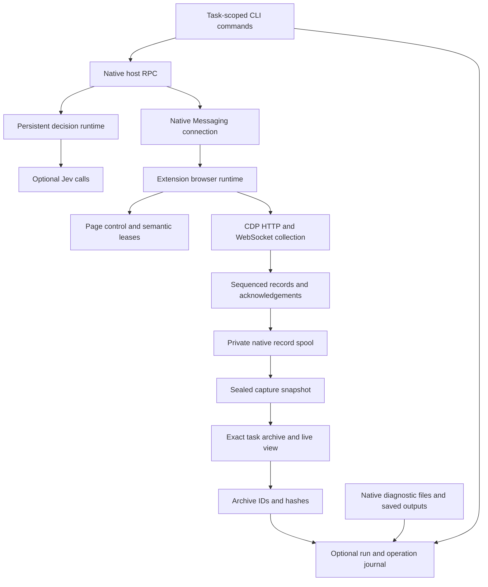

# Browser runtime and evidence architecture

Rep connects task-owned browser work to saved observations and local artifacts.
Browser control, model decisions, network collection, and evidence storage have
separate responsibilities. A run links their results using explicit references;
it does not infer a complete causal history of the browser or a remote service.


```mermaid
flowchart TD
    CLI[Task-scoped CLI commands] --> Host[Native host RPC]
    Host --> Decisions[Persistent decision runtime]
    Decisions --> Jev[Optional Jev calls]
    Host --> Bridge[Native Messaging connection]
    Bridge --> Runtime[Extension browser runtime]
    Runtime --> Page[Page control and semantic leases]
    Runtime --> Capture[CDP HTTP and WebSocket collection]
    Capture --> Transport[Sequenced records and acknowledgements]
    Transport --> Spool[Private native record spool]
    Spool --> Snapshot[Sealed capture snapshot]
    Snapshot --> Archives[Exact task archive and live view]
    CLI --> Evidence[Optional run and operation journal]
    Archives --> References[Archive IDs and hashes]
    References --> Evidence
    Files[Native diagnostic files and saved outputs] --> Evidence
```

## Responsibilities

| Layer | Location | Owns |
|---|---|---|
| Command interface | `cmd/browser_*.go`, `cmd/evidence.go`, `cmd/stream.go` | Scope, arguments, deadlines, bounded output and explicit run selection |
| Connection | `cmd/browser_connection.go`, `internal/bridge` | Arc/Chrome or the selected task's headless bridge |
| Protocol | `internal/browserrpc`, `internal/jevrpc` | Typed browser/decision RPCs, CDP wrapping and lease ownership |
| Interaction executor | `internal/browserflow` | Plan validation, target checks, input adapters and declared postconditions |
| Decisions | `internal/jevdom`, `cmd/host/decision_runtime.go` | Compact observations, frame-aware bindings, reusable decisions, batching and persistent provider connections |
| Extension control | `rep/js/background/browser-runtime.js`, `page-control.js`, `semantic-runtime.js` | Tabs, lifecycle waits, screenshots, debugger attachments, document identity and execution leases |
| Extension capture | `rep/js/background/cdp-capture.js`, `body-capture.js` | HTTP bodies, WebSocket events, collection limits, completeness and loss accounting |
| Native capture storage | `cmd/host/record_spool.go`, `capture_writer.go`, `capture_snapshots.go` | Record acknowledgement, disk spooling, snapshot limits and sealing |
| Task archives | `internal/store` | Saved captures, exact archive selection, body/stream records and offset indexes |
| Run evidence | `internal/evidence`, `cmd/operation_evidence.go` | Durable operation records, artifact bytes, declared provenance and evidence references |

The interaction executor takes a selection callback and does not import Jev.
Exact selectors and names need no model call. The native host owns a bounded
provider-client pool, so separate CLI invocations can reuse connections.
Observation, storage, hashing, pagination and archive lookup require no model.
See [decision runtime](decision-runtime.md) for selection and reuse semantics.

## Scope and browser ownership

Every independent agent selects a workspace and a distinct task, using flags or
process environment. Data is stored beneath that task's directory. There is no
shared current-workspace or current-run pointer. Browser cookies and tabs remain
shared when agents use the same browser profile; task-owned headless profiles
provide separate login state when needed.

Explicit network capture operations are queued by the capture controller. A
capture cannot start on a tab with an active semantic execution lease. Page
navigation and semantic execution also reject conflicting capture ownership.
This release keeps those ownership boundaries: there is no concurrent `--record`
mode around an arbitrary semantic action. Use explicit capture operations and
link separate navigation, interaction and capture phases through the same run.

`browser action` is the existing combined renderer-action/network-capture
primitive. It owns its capture for that operation. Selection or a plain
`browser navigate` does not implicitly start a network capture.

## Page workflows

```sh
export REP_WORKSPACE=demo REP_TASK=local-inspection
rep browser create about:blank --raw-json
rep browser navigate http://127.0.0.1:8000 --tab TAB_ID --wait load --raw-json
rep browser observe --tab TAB_ID --raw-json
rep browser select 'Save button' --tab TAB_ID --raw-json
rep browser interact flow.json --tab TAB_ID --apply --raw-json
rep browser screenshot --tab TAB_ID --raw-json
```

`navigate` waits for a selected lifecycle condition. `screenshot` writes a private
image and returns metadata; `shots` processes an explicit URL list with bounded
parallel workers. `interact` previews a typed plan unless `--apply` is supplied.
`step` proposes one operation from an observation and similarly requires
`--apply` for execution. Known field values stay local to execution; the model
receives value names.

A click or a model's `DONE` decision does not prove that a form was submitted.
Verification applies to the declared check. If the post-action observation
fails, the result preserves `page_changed: null`, an unknown observation status,
and the error. It does not turn an absent observation into `false`.

## Capture data and protocol visibility

| Source | Stored evidence | Visibility boundary |
|---|---|---|
| HTTP/HTTPS | Request/response metadata, bounded bodies, redirects, failures, frame/loader/session identity | Bytes and fields exposed by the browser after attachment |
| HTTP/2 and HTTP/3 | Browser-reported protocol and connection metadata plus HTTP content | No transport-frame or QUIC-packet reconstruction |
| SSE and NDJSON | Captured response bytes and bounded application-record views | Unfinished streams retain partial evidence |
| WebSocket | Connection lifecycle, handshake metadata, ordered sent/received events, opcodes, text or binary payloads, errors | Browser-exposed messages; masking, compression and network fragmentation cannot be reconstructed |
| WebTransport | CDP lifecycle; opt-in API datagrams and uni/bidirectional stream chunks | Page-controlled instrumented API calls; API and CDP identities are separate |
| WebRTC data channels | Opt-in API text/binary messages, channel metadata and peer state changes | Application messages; no RTP/media or SCTP packet capture |
| WebRTC audio/video | Opt-in native MediaRecorder container chunks from track clones | Re-encoded media during the recorded interval; page-controlled observation |
| Native browser diagnostics | New private Chromium session emits TLS/QUIC keys and original plaintext RTP/RTCP at the SRTP boundary | Explicit diagnostic flags; supported output must be observed; packet loss, additional application encryption and codec negotiation remain relevant |
| Interface packets | Native libpcap writes filtered packets to private pcap files with capture metadata | OS capture permissions and interface scope; QUIC/SRTP remain encrypted |
| Native diagnostic files | Original imported bytes plus collector/build/device/trial metadata | The external collector defines coverage; imports do not execute or decode files |

`--protocol-payloads` installs the WebTransport/WebRTC observer before navigation
or captured evaluation and restores it at capture end. Records declare source,
realm clock, effective limits and gaps. See [transport capture](transport-capture.md).
`packets capture` and `--webrtc-media` provide separate packet and media
collectors with explicit provenance. See [native capture](native-capture.md).
Unknown imported formats remain opaque bytes. HTTP metadata now
retains protocol, addresses, connection identity/reuse, timing, security details,
cache/service-worker indicators and encoded length where CDP supplies them.
Monotonic and wall-clock values keep their source meaning; Rep does not assume
that clocks from different devices are synchronized.

Completed capture records move incrementally to a private native-host spool.
The host keeps a compact record index, validates message sequence, and
acknowledges accepted data. Large records use bounded fragments with length and
hash checks. Sealing copies validated records into an exact snapshot. The CLI
checks the snapshot identity/count/hash and publishes the selected task's live
view and durable archive. A missing snapshot never falls back to another task's
current capture.

The spool batches small writes in a 256 KiB buffer. An intermediate ACK confirms
acceptance; the successful final seal confirms the flushed, synchronized snapshot.
Truncated spools, failed flushes, sequence gaps and mismatched counts refuse
publication. Same-session abort is idempotent, including after a lost final ACK,
and cannot reset another active capture.

The acknowledged incremental protocol is checked before capture actions. An
older native host is rejected before the page action begins. Native spooling
reduces retained capture payloads in host memory, but the largest individual
record still has to be decoded/serialized. Host startup can also load a previous
live file. Spools, snapshots, archives and imported artifacts have separate
storage policies; their limits do not form one global disk ceiling.

The collector defaults to 64 MiB of aggregate archived payload bytes, 10,000
request/connection records, 10,000 WebSocket events and a 16 MiB native-send
backlog. HTTP bodies and WebSocket messages also have individual limits. Limits
and capture statistics disclose truncation, omissions and failures. They are
not strict process RSS caps: browser/CDP messages, decoding and serialization
can allocate transient copies. See [body capture](body-capture.md).

## Run and artifact storage

Create a run with `evidence begin`, then pass its returned ID as `--run RUN_ID`
to supported commands. The CLI synchronizes a pending operation record before
browser work and appends a completion record linked by `parent_id`. Interrupted
work may leave only the pending record. A missing completion is not permission
to repeat a potentially completed action.

Operation status, verification and model claims are separate fields. Available
archive identities, artifact IDs and observation fingerprints become references.
A fingerprint is labeled as such; it is not a retained DOM snapshot. Result
summaries and reference lists are bounded and disclose omissions. Commands
without `--run` do no evidence-journal I/O or extra observations.

Imported bytes are streamed to task-local content-addressed storage. Each
import retains its own manifest, including for repeated bytes from different
trials. SHA-256 identifies bytes; declared coverage and trial outcomes remain
separate. See [run evidence](evidence.md) for commands, schemas and limits.

Durable network archives still contain inline JSONL bodies. Saved lookups use
an offset index and decode the selected session. Index validity depends on the
source inode/device, size and modification time under the log's shared lock.
Normal appends update the index under its existing exclusive lock. Missing or
stale indexes rebuild lazily; the metadata index is capped at 8 MiB, with a
legacy lookup fallback above that bound. `body`, `stream`, and saved
`summary`/`context` use this path. The `--primary` filter still loads saved
settings through the existing store path. Opening an evidence run store performs
constant work and never scans historical operation records.

## Local measurements

Measured on an Apple M1 Max, macOS/arm64, using Go benchmarks on 2026-09-26.

| Fixture operation | Result |
|---|---:|
| Open a task evidence store after 100 runs | 53 µs/op |
| Read a 10-operation tail page after 1,000 records | 622 µs/op |
| Append one operation with durable file/index synchronization | 10.3 ms/op |
| Import a 1 MiB artifact, including synchronization and duplicate-byte verification | 25 ms/op, about 42 MB/s |
| Select one small saved archive with a disk-loaded index over 100 unrelated 64 KiB bodies | 156 µs/op; 90 kB allocated |
| Load all sessions for the same archive fixture | 26.5 ms/op; 7.17 MB allocated |

The saved-lookup benchmark clears the process index cache each iteration for
the 156 µs measurement; the source index already exists. A legacy first read
pays the rebuild cost. Filesystem caches remain subject to the operating system.
The evidence benchmarks used `-benchtime=100ms`; archive lookup used `150ms`.
These measurements exclude CLI process startup, browser/provider latency and
continuous network collection. Durable journaling has an explicit cost and is
opt-in. No sustained capture-throughput result is claimed here.

The later [protocol/evidence fixture](validation/protocol-evidence-2026-09-26.json)
checks real Chromium messages and local form outcomes. Its 2,048-message, 2 MiB
receive burst retained every payload with matching order/hash and zero reported
loss. Capture took 1.066 s including navigation, a 500 ms idle interval,
transport, sealing, archive/run writes and host RSS sampling. The native host
had a sampled peak of 29.5 MiB; Chromium and other processes are excluded, and
50 ms sampling can miss peaks. This fixture and the HTTP body fixture ran in
separate owned profiles concurrently. A burst does not establish sustained
throughput, wire rate or complete browser memory overhead.

After adding the spool buffer, ingestion of 10,000 small records averaged
21.24 ms versus 185.28 ms for the legacy in-memory path (three iterations on the
same M1 Max). This excludes collection, transport, sealing and fsync. Allocation
volume was higher: 38.93 MB versus 27.22 MB; that does not measure retained RAM.
The change avoids whole-capture body retention and repeated live-file rewrites.

```sh
go test ./cmd/host -run '^$' -bench BenchmarkCaptureRecordIngestion -benchtime=3x -benchmem
REP_BINARY=/tmp/rep/rep REP_HOST_BINARY=/tmp/rep/rep-host \
  python3 scripts/verify_protocol_evidence.py --stress --output /tmp/protocol-results.json
```

```sh
go test ./...
go test -race ./internal/evidence
go test ./internal/evidence -run '^$' -bench BenchmarkEvidence -benchtime=100ms
go test ./internal/store -run '^$' -bench BenchmarkArchiveIndexedLookup -benchtime=150ms
cd ../rep && npm test
```

Earlier browser refactor measurements and live fixture runs remain in
[the September 20 headless report](validation/architecture-interactions-2026-09-20.json),
[Arc report](validation/architecture-arc-interactions-2026-09-20.json), and
[capture report](validation/architecture-body-capture-2026-09-20.json).
Those historical installed-build results do not establish that the current
checkout is already installed or active in a browser.
