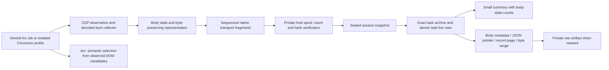

# Reliable bodies, bounded parsing, and persistent browser control

Implemented and locally verified 2026-09-20. This extends the
[task ownership architecture](agent-context.md) and uses the same capture path
for Arc and [task-owned headless Chromium](headless.md).

## Failure modes that were fixed

Several independent problems could make the correct response disappear:

| Previous behavior | Result | Current behavior |
| --- | --- | --- |
| Compressed bodies skipped | Small gzip transfer hid a large decoded response | Collect decoded CDP bytes; do not compare compressed length to decoded length |
| Unknown/zero encoded size treated as no body | Cached or chunked responses disappeared | Stream available bytes; use browser response-buffer fallback |
| 768 KiB extension ceiling | Larger responses omitted | Default 8 MiB, explicit configurable body budget and partial evidence |
| Capture ended before new/slow body promises settled | Late bodies lost | Freeze the observation boundary, drain body work, seal once, reject late mutation |
| Child target request IDs shared one namespace | Frame/worker requests could collide | Attach related targets and namespace their request IDs |
| One oversized native message | Large record could not cross the bridge | Ordered 192 KiB fragments with total length and SHA-256 verification |
| Queue disconnects and request trimming silently dropped records | Successful-looking incomplete capture | Bind capture to one native connection; verify expected request count; fail explicitly |
| Empty body printed without evidence | Agent confused missing with genuinely empty | Complete/partial/unavailable/pending/not-applicable/legacy-unknown states |
| `body --head` bypassed JSON and could dereference a missing response | Broken agent parsing or request-body crash | One bounded JSON contract, correct byte ranges, separate request/response evidence |
| Canvas returned entire body in evaluation result | Large body exceeded native host's return-message limit | Small evaluation metadata, archive-pinned body artifact, exact byte/hash checks |

## One evidence path



Jev remains the semantic decision layer. Transport integrity, ownership, body
assembly, parsing, and pagination are deterministic and need no model calls.
Jev cannot establish that missing response bytes were captured. Its existing
freshness checks and cache also apply through `--browser headless`.

The response collector preserves buffered bytes before streamed bytes even when
the stream setup callback arrives after data events. It retains binary data,
UTF-8 BOMs, and split codepoint prefixes exactly. Non-UTF8 or incomplete text is
stored as base64 with its encoding declared. `body` decodes that representation
before byte counts, digest checks, ranges, or raw file export.

Body state describes evidence, independently of HTTP status. A 200 response can
still have a partial body. A capture's network-idle condition does not prove an
open SSE stream ended. Body limits, network failures, capture deadlines, missing
browser buffers, and detached child targets have explicit reasons. Coverage
warnings disclose unavailable related-target support. Requests that occurred
before attachment cannot be reconstructed by this implementation.

The native host spools oversized serialized records privately, verifies sequence,
chunk count, total bytes, and SHA-256, then incorporates the record. Missing,
corrupt, conflicting, or foreign-session data cannot produce a verified snapshot.
The session's expected request total catches a whole record disappearing. Snapshot
and archive I/O serialize/decode one request at a time; staged archive appends
use locks, fsync, and rollback on write errors. Malformed archive tails report an
error instead of silently resetting history.

## Read only the useful part

Use a stable task identity and the capture's full archive hash:

```sh
rep --workspace research --task site-a body REQUEST_ID --saved SAVED_HASH --info
rep --workspace research --task site-a body REQUEST_ID --saved SAVED_HASH --pointer /data/items/0
rep --workspace research --task site-a body REQUEST_ID --saved SAVED_HASH --format ndjson --records 20
rep --workspace research --task site-a body REQUEST_ID --saved SAVED_HASH --format sse --record-offset 20 --records 20
rep --workspace research --task site-a body REQUEST_ID --saved SAVED_HASH --find 'desired text'
rep --workspace research --task site-a body REQUEST_ID --saved SAVED_HASH --offset 8192 --head 4096
rep --workspace research --task site-a body REQUEST_ID --saved SAVED_HASH --require-complete --save -j
```

HTTP transfer chunks, CDP chunks, and native messaging fragments are different
from application records. SSE parsing dispatches only blank-line-terminated
events, joins data lines, and preserves event IDs. NDJSON parses complete JSON
records, preserves large integers, and discloses unfinished trailing bytes.
JSON pointers skip unrelated subtrees and reject invalid/incomplete documents.
Other application wire formats remain available through raw ranges and literal
search; the tool does not claim to decode every framework-specific protocol.

Inline body output defaults to an exact 8,192-byte JSON budget. Budgeting first
bounds the candidate prefix, avoiding repeated serialization of an entire large
body. `view_complete` concerns only the selected projection; `body_capture.state`
concerns captured evidence. A partially emitted record page does not advance its
record cursor. Continue the same page with byte offsets or read its private
artifact before moving to later records. `rep describe body` is the full contract.

Canvas's read adapter now drains the authorized response while returning only
small renderer metadata. It resolves candidate request IDs by exact URL, method,
and status in the verified archive, allowing OPTIONS/unrelated reads while
rejecting ambiguous matches. It requires complete body evidence, validates the
private raw file's identity, size, hash, and UTF-8, and removes only that consumed
artifact. The complete response remains in its archive. Existing read-only and
manual-redirect rules remain part of the Canvas adapter's contract.

## Budgets and storage costs

The system cannot make a finite browser, disk, or Native Messaging channel
unlimited. Budgets are now visible and failures are explicit.

| Resource | Default | Configuration |
| --- | ---: | --- |
| Decoded body per captured request | 8 MiB | `--max-body`, 0 through 256 MiB; invalid values fail |
| Serialized request accepted by host | 384 MiB | `REP_CAPTURE_MAX_REQUEST_BYTES` in host environment |
| One sealed snapshot | 512 MiB | `REP_CAPTURE_MAX_SNAPSHOT_BYTES` |
| Aggregate temporary snapshots | 1 GiB | `REP_CAPTURE_TOTAL_SNAPSHOT_BYTES` |
| Requests per capture | 10,000 | `REP_CAPTURE_MAX_REQUESTS`; exceeding it fails publication |
| Temporary snapshot retention | 32 entries / one hour | Retained host policy |
| Inline body output | 8 KiB | `--max-bytes` |

Environment changes apply when the native host starts; merely setting them on an
already connected CLI does not reconfigure its running host. The CLI negotiates
the actual host snapshot limit. The serialized size can exceed decoded size due
to base64 or JSON escaping. Raising one budget does not raise the others.

Durable archives still use inline JSONL bodies, and archive lookup can load all
sessions in one task into memory. Per-request serialization reduces extra
capture-sized copies but does not make peak memory constant: the current capture,
largest individual record, and loaded archives still matter. A content-addressed
body store plus lazy archive index is future storage work, not a shipped feature.

## Verification

The Go suite, host/store/headless race tests, 237 extension tests, and 119 Canvas
tests passed. Regression coverage includes compressed/cached bodies, late setup
callbacks, empty and partial streams, child request ID collisions, detached
frames, Unicode/BOM/binary preservation, missing/corrupt fragments, archive write
failure, immutable retrieval, JSON pointers, record pagination, and output budgets.

An actual JavaScript fragment sender transferred 2,250,000 decoded Unicode bytes
through 13 frames to the compiled Go native host. A corrupt frame failed while
the earlier valid snapshot remained available. A Canvas adapter test read a
3 MiB body with a 4 KiB stdout budget.

`scripts/verify_body_capture.py` runs a real isolated headless browser against
loopback fixtures: over-2-MiB gzip JSON, chunked NDJSON, finite/open SSE, binary,
exact artifacts, and archive reuse. One optional Jev call selected the intended
test button. Measurements and repeatable commands are in [headless.md](headless.md).
These are local fixture results, not a guarantee about every remote website.

The updated CLI and native host are installed in `~/.local/bin`, and the Arc
extension was reloaded while it had zero active/queued captures. An actual Arc
metadata-only action then captured all 2,109,569 decoded bytes of the gzip fixture
through `cdp-stream`, verified the archive and exact raw artifact, and closed its
owned test tab. The installed binaries also passed the headless fixture and the
two-agent isolation check. Temporary test profiles and task data were removed.

Primary protocol references: [CDP Network](https://chromedevtools.github.io/devtools-protocol/tot/Network/),
[Chrome related-target debugging](https://developer.chrome.com/docs/extensions/reference/api/debugger#attach-to-related-targets),
[Native Messaging framing](https://developer.chrome.com/docs/extensions/develop/concepts/native-messaging),
[SSE parsing](https://html.spec.whatwg.org/multipage/server-sent-events.html#parsing-an-event-stream),
and [JSON Pointer](https://www.rfc-editor.org/rfc/rfc6901).
