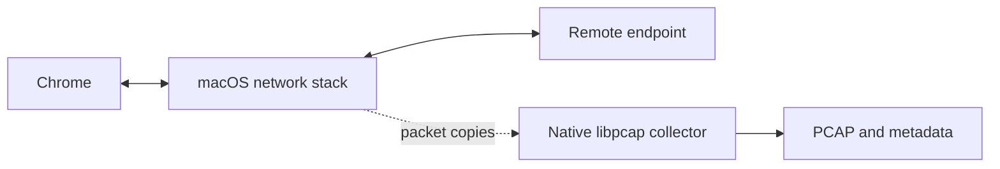
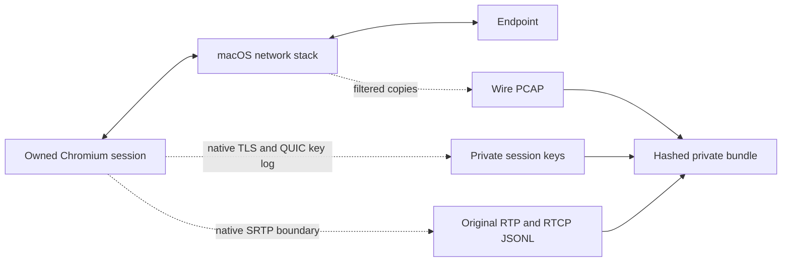

# Native packets and WebRTC media

Rep has separate collectors for interface packets, native browser diagnostics,
application payloads and browser media recordings. Each declares its own
observation scope.

| Evidence | Command | Capture source |
|---|---|---|
| Raw interface packets, including encrypted QUIC/SRTP | `rep packets capture` | Native libpcap with an explicit interface and BPF filter |
| TLS/QUIC session keys plus filtered wire packets | `browser native-capture --tls-keys` | Native Chromium key logging in a new private session, plus libpcap |
| Original encoded RTP/RTCP datagrams | `browser native-capture --webrtc-rtp` | Native libWebRTC before SRTP protection and after successful unprotection |
| WebTransport and RTC data-channel application bytes | `browser open/action --protocol-payloads` | Instrumented page APIs |
| Audio/video from existing WebRTC tracks | `browser open/action --webrtc-media` | Chromium MediaRecorder on track clones |

## Capture architecture

Native packet capture passively reads copies supplied by the operating system.
Chrome keeps its ordinary connection to the remote endpoint. Packet collection
requires no proxy, replacement certificate, browser launch flag, extension or
page API hook.



Three independent boundaries determine the result:

| Boundary | What changes it |
|---|---|
| Opening a BPF device | Administrator-approved device permissions; a denial prevents live packet collection |
| Encrypted QUIC, TLS or SRTP payloads | BPF permissions supply encrypted packets. A newly owned diagnostic session can explicitly emit TLS/QUIC keys and plaintext RTP separately |
| Browser media recordings | `--webrtc-media` re-encodes track clones; `native-capture --webrtc-rtp` retains original encoded RTP/RTCP bytes from native libWebRTC |

The native packet path can observe an ordinary browser session without attaching
the browser collector. The optional `--webrtc-media` and `--protocol-payloads`
paths install page API instrumentation. Those changes and their resource costs
can be observed by page code. Rep makes no guarantee that an instrumented
browser session is undetectable.

## Native browser diagnostics

For original encoded media and decryptable TLS/QUIC evidence, use a newly owned
Chromium diagnostic session:

```sh
rep --workspace demo --task native browser native-capture http://127.0.0.1:8080 \
  --tls-keys --webrtc-rtp --interface lo0 \
  --filter 'udp and host 127.0.0.1 and port 8443' \
  --duration 30s --output /tmp/rep-native-session
```

The session uses a fresh profile without the Rep extension or page API hooks.
Rep adds no proxy or substitute certificate. The default opens a visible window;
`--headless` selects headless Chromium. An explicit `--binary` or
`REP_HEADLESS_BINARY` can choose an installed build. Browser diagnostics remain
observable through flags, timing or resource effects; ordinary browsing and
diagnostic browsing are not guaranteed to behave identically.
The owned loopback CDP endpoint and optional headless launch can expose
automation-related state such as `navigator.webdriver`; Rep does not mask it.



Chromium's `--ssl-key-log-file` configures its network service, and its QUIC
context installs the same native key-log callback. Compatible analyzers can use
these keys with matching retained packets. The wire capture remains encrypted;
the keys enable explicit offline decryption. The command requires an interface
and filter with `--tls-keys`, starts libpcap before navigation, and reports missing
key output without claiming that the switch worked. See the
[network service implementation](https://chromium.googlesource.com/chromium/src/+/refs/heads/main/content/browser/network_service_instance_impl.cc),
[QUIC context](https://chromium.googlesource.com/chromium/src/+/refs/heads/main/net/quic/quic_context.cc),
and [Wireshark TLS key-log documentation](https://wiki.wireshark.org/TLS).

The BPF filter limits only the wire PCAP. Key logs can include the new browser's
background TLS sessions, and RTP logs cover that private browser's peer
connections. Neither is restricted to one URL by the interface filter.

For WebRTC, the native `WebRTC-Debugging-RtpDump/Enabled/` diagnostic emits full
packet bytes from `SrtpSession`: outgoing before encryption and incoming after
successful authentication/decryption. Rep enables that diagnostic and its native
log category, then parses the retained log into exact base64 datagrams with
direction, ordinal and available timestamp provenance. It does not create a
MediaRecorder, clone a track, or encode media again. This path does not require
DTLS/SRTP session-key export. See the
[native SRTP implementation](https://webrtc.googlesource.com/src/+/refs/heads/main/pc/srtp_session.cc)
and [Chromium native logging](https://www.chromium.org/for-testers/enable-logging/).

Plaintext datagrams are not a playable media container. Decoding needs the
negotiated codec mapping, packet ordering, retransmission handling and complete
codec frames. RTP dynamic payload numbers alone do not identify a codec.
Application-level encrypted frames remain encrypted. Outgoing log records do not
prove delivery, while incoming packets rejected by SRTP are absent. The native
dump's inner timestamp can have incorrect hour/minute values; Rep preserves raw
timing provenance without treating it as verified wall time. Native logs may
interleave or drop entries, so parser loss and retained-byte limits are explicit.

The output directory is created exclusively with mode 0700. Artifacts use 0600;
the manifest lists hashes and byte counts without embedding keys or media.
`--run` imports that manifest and records external artifact references. It does
not duplicate sensitive payloads in the evidence store. The private browser and
profile are stopped and removed after browser exit is confirmed. If exit cannot
be confirmed, the operation fails and preserves the profile and unfinalized
artifacts; `browser.profile_removed` remains false. Existing profiles and tabs
are independent.

Default limits are 15 seconds after navigation, 32 MiB each for browser log and
derived RTP JSONL, a 1 MiB key-file threshold and 64 MiB of wire PCAP. The parser
also caps output at 100,000 datagrams and source lines at 256 KiB. The browser log is drained after its exact retained-byte
limit while shutdown is requested. The key file is written by Chromium and its
monitored threshold can overshoot before shutdown; this is reported. Complete
key-log lines within the retained budget are kept after shutdown. The requested
observation duration is bounded to ten minutes, with additional startup (up to
30 seconds), navigation and shutdown time. See `rep describe native-capture`
for the command contract.

## Capture packets

Build with cgo enabled on macOS and the Xcode command-line tools. The packet
collector links the system libpcap. It reports an unavailable backend in builds
without native capture support; offline inspection still works.

```sh
rep --workspace demo --task packets scope -j
rep --workspace demo --task packets summary --max-bytes 4096
rep packets interfaces

# Set the filter to the addresses and ports used by your own local fixture.
rep --workspace demo --task packets packets capture --interface lo0 \
  --filter 'udp and host 127.0.0.1 and port 8443' \
  --duration 10s --output /tmp/fixture.pcap
rep --workspace demo --task packets packets inspect /tmp/fixture.pcap --limit 20
```

The compiled C callback writes buffered pcap records without a Go/JavaScript
callback or JSON serialization for each packet. Capture is non-promiscuous,
bounded by time, packets and bytes, and cancellable. A private sidecar preserves
the filter, limits, link type, timestamps, loss counters and file hash.
`--run RUN_ID` records the operation and imports the capture artifacts into the
selected task's evidence store. See [packet capture](packet-capture.md).

macOS requires permission to open a BPF device. Interface listing alone does not
prove that capture is permitted. If capture returns a permission error, grant
the current account packet-capture access through your machine's approved BPF
setup, then rerun the narrowly filtered command. Installing or reloading the
browser extension cannot grant this OS permission.

On a Mac with Wireshark installed, its signed ChmodBPF package is the supported
setup route. Open it and complete macOS's administrator-controlled installer:

```sh
open "/Applications/Wireshark.app/Contents/Resources/Extras/Install ChmodBPF.pkg"
```

See [Wireshark's macOS installation guide](https://www.wireshark.org/docs/wsug_html_chunked/ChBuildInstallOSXInstall.html).

ChmodBPF's launch daemon prepares BPF device permissions for the `access_bpf`
group when loaded, then exits. It does not record packets. Once the approved
account has device access, Rep runs as that ordinary user and starts capture
only for an explicit `packets capture` command. A continuously recording root
daemon is unnecessary for this path. Administrator authorization addresses
device access; it does not remove protocol encryption or change media fidelity.

Packets contain the encrypted bytes delivered by the capture interface. The
collector does not decrypt QUIC, SRTP or TLS, recover process keys, or infer
ownership from a matching URL. Packet timestamps and browser timestamps use
different clocks. A common run links evidence explicitly; it does not establish
that a packet belongs to a particular tab, track or browser connection.

Native loss counters are included with their platform limits. Zero reported
drops is not proof that all transmitted packets were observed. Offload, filter
choice, interface choice and kernel buffering affect the observation.
[libpcap statistics](https://www.tcpdump.org/manpages/pcap_stats.3pcap.html)
describe these platform differences.

## Capture audio/video

```sh
rep --workspace demo --task media browser open https://localhost:8443 \
  --webrtc-media --protocol-payloads --keep-tab --raw-json

# Or start the app's media workflow in an already owned tab.
rep --workspace demo --task media browser action @start-local-call.js \
  --tab TAB_ID --webrtc-media --settle 5s --raw-json

rep --workspace demo --task media media RECORD_ID --saved HASH --info
rep --workspace demo --task media media RECORD_ID --saved HASH \
  --require-complete --save recording.webm
```

Install observation before the application creates its peer connections.
`--webrtc-media` is independent of `--protocol-payloads`; both are explicit
capture options. No microphone, camera or display request is made. The
collector clones tracks the application already supplies or receives, and stops
only its recorders and clones during cleanup. Application tracks and calls
continue. Tracks created before observation or through bypassed native methods
can remain unobserved.

Each direction and track has a separate `webrtc_media` record. Metadata includes
MIME type, track kind, track/peer IDs and the realm's time origin. The source is
`browser_media_recorder`, semantics are `reencoded_media`, and completeness is
limited to `recorded_media_interval`. The browser's native encoder performs
compression; the observer still copies and serializes container chunks.
Recording adds encoding and memory work and can affect a latency experiment.

The initial bounds are eight simultaneous tracks per realm, 60 seconds and
4 MiB encoded bytes per track, with 250 ms requested timeslices. Shared capture
limits still apply. Requested timeslices are not a precise delivery schedule;
native encoder buffers and browser memory are outside retained-byte limits.
Gaps, limits, errors and missing final chunks remain partial evidence.

`rep media` streams decoded base64 chunks into one file with a SHA-256 hash,
checks ordering against the final recorder's chunk and byte counts, and refuses
to overwrite existing files. Saved archive aliases resolve to one archive ID,
which is retained in the export and its run evidence.
Individual timeslices need not be playable. A complete recording assembles all
of its container segments; see the
[MediaRecorder data handling contract](https://www.w3.org/TR/mediastream-recording/#data-handling).
The CLI does not run a media decoder and reports playability as unverified.
Use `rep stream` for selected chunk bytes and detailed coverage.

These recordings contain browser-encoded media. They do not preserve the exact
original RTP codec frames or establish end-to-end frame fidelity. Renderer
instrumentation remains page-controlled; archive hashes verify retained bytes.

## Verify the collectors locally

The [native browser verification](validation/native-browser-diagnostics-2026-09-27.json)
passed on Chromium 153.0.8010.12 using a new private profile and synthetic local
traffic. Native TLS keys enabled Wireshark to recover the exact 106-byte QUIC
payload and echo; the negative control recovered neither without keys. All 692
native datagram records matched their raw-log bytes, with 346 exact outgoing and
incoming pairs. Original Opus packets decoded to the expected 440 Hz tone, and
31 original VP8 frames decoded to moving 320×180 video. Container assembly and
RED unwrapping did not re-encode the captured media.

The same verification checked exclusive private files, artifact hashes,
complete browser/profile/endpoint cleanup, exact log caps with partial status,
and cancellation with a nonzero exit. The headless fixture reported
`navigator.webdriver: true`; no browser fingerprint was masked. These results
establish the tested local codecs and traffic, not universal codec or browser
support. The report pins the tested binary and runtime source hashes.

Reproduce with an isolated Python environment containing `aioquic==1.2.0`, a
Python interpreter with `websocket-client`, and installed Wireshark/FFmpeg:

```sh
REP_BINARY=/path/to/rep python3 scripts/verify_browser_diagnostics.py \
  --quic-python /path/to/private-venv/bin/python \
  --output /tmp/native-browser-diagnostics.json
```

Run the Go and extension suites, then build matching CLI and native-host binaries:

```sh
go test ./...
npm --prefix ../rep test
REP_SKIP_TESTS=1 scripts/build_install.sh --host --install-dir /tmp/rep-native
REP_BINARY=/tmp/rep-native/rep REP_HOST_BINARY=/tmp/rep-native/rep-host \
  python3 scripts/verify_native_capture.py --output /tmp/rep-native-results.json
```

The integration fixture uses a private Chromium profile, generated canvas video
and oscillator audio, local peer connections, and two owned loopback UDP ports.
FFmpeg and ffprobe decode each complete exported media recording. The fixture
checks archive byte identity, partial capture rejection, continued original
track activity, output permissions, and evidence artifact hashes. Its temporary
profile, recordings and archives are removed after verification.

Native package tests replay constructed PCAPs through the same C writer,
BPF filter, cancellation and limit handling as live capture. Offline replay
does not establish permission to capture from an interface. The integration
report records BPF denial as `packets.live.state: unavailable`; its overall
`passed` field can still be true when that expected failure was handled correctly.
Check `live_packet_capture_verified` for actual live packet validation.

The [September 27 integration result](validation/native-capture-completion-2026-09-27.json)
passed on Chromium 153: four complete outgoing/incoming audio/video recordings
matched their archived chunks and decoded successfully; four deliberately
limited recordings remained partial and failed `--require-complete`. Original
tracks continued carrying media after recorder cleanup. Both offline packet
variants passed header/offset checks. Live capture was unavailable because macOS
denied BPF access, and the failed attempt retained both verified evidence files.

The [permission setup follow-up](validation/native-packets-permission-fixed-2026-09-27.json)
verified live capture with the same binaries after the signed ChmodBPF installer
restored device access. Rep ran as the ordinary user and captured all four
loopback UDP fixture packets with exact payload matches: 496 captured/original
bytes, no truncation and zero reported drops. Both evidence artifacts and their
hashes were verified. The permission helper had completed and was idle during
capture. This verifies the local fixture; it does not establish completeness
for other interfaces or traffic.

## Apply a build to the current extension

```sh
# Run from the CLI repository after the required checks pass.
scripts/build_install.sh --host --install-dir "$HOME/.local/bin"
npm --prefix ../rep test

# Reload only when shared captures have finished.
rep browser reload-extension --browser arc --wait 20s --raw-json
rep browser status --browser arc --raw-json
```

Load the unpacked extension from the matching `rep` source directory and keep
its native-host manifest pointing to the installed `rep-host`. Status must
include `webrtc_media_v1` and `protocol_payloads_v1`. The guarded reload command
rejects an active shared capture. A private headless profile picks up changed
extension code after its own stop/start cycle.
